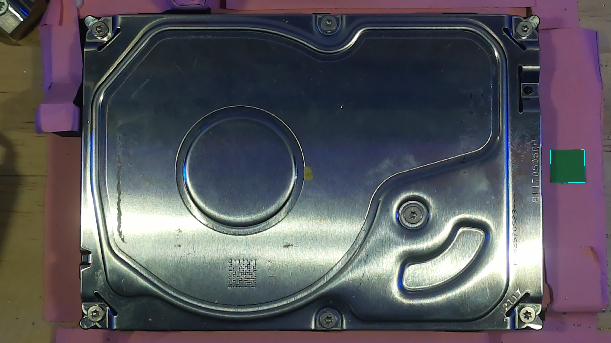
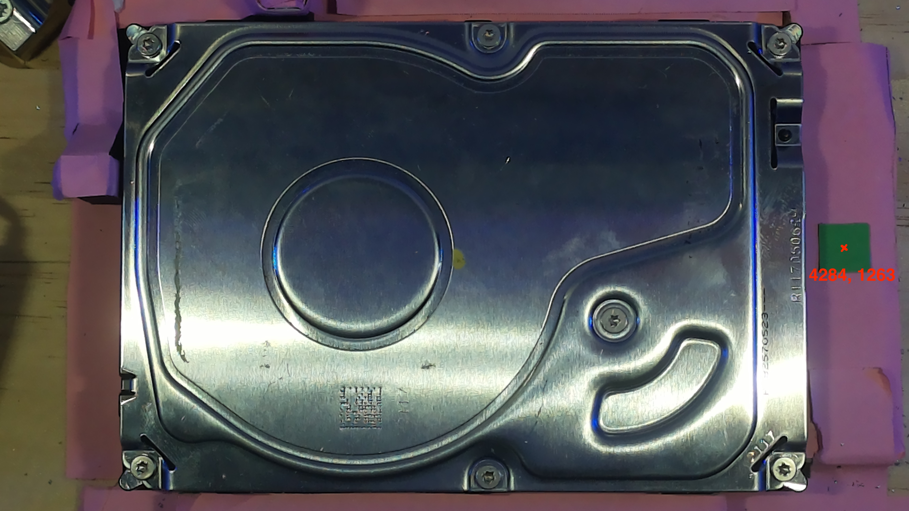

# Absolute Origin
## Introduction and Motivation
Currently, we are able to find pixel coordinates for the screws in an image and we are able to convert these coordinates into millimetre distances. However, the coordinates are relative to the top left corner of the image, that is (0, 0) is at the top left corner of the image. The issue with this is that it is difficult to translate the top left corner of the image into a real-world (or global) coordinate for the milling machine to start from. Therefore, there came the need to have an exact point that could be used as an origin – a point with a known global position and that can be provided with a pixel coordinate for each image. 

### Methodology
1. A small green square made of paper was placed near the hard drive. The exact position of where it was placed is unimportant.
2. The global position of the centre of the square is found using the milling machine's manual override. This was found to be **(110.5, 122)**
3. An image is taken of the hard drive
4. During image post-processing, the green colour in the image is found and using the same technique used in finding the pixel to millimetre ratio, the perimeter of the square is detected. 
5. From there, the centre of the square is found as a pixel coordinate.

Finding the green square visualised:

Finding the pixel coordinates of the green square:

### Finding Screw Global Positions
With this absolute origin, we can now describe the general process of finding the absolute coordinate of a screw. This is laid out below.

1. Take an image of the hard drive
2. With the image, we find the pixel origin and the horizontal and vertical ratios to convert pixels into millimetres.
3. With the *same* image, we run the object detection model to find the position of the screws
4. From a particular screw, we can determine the horizontal and vertical displacement IN PIXELS from the green square, to the screw.
5. Using the ratios, we can convert these pixel displacements into millimetre displacements
6. Since the absolute position of the global origin is known (and fixed), we can add these displcaments to the origin to find the global position of the screw.