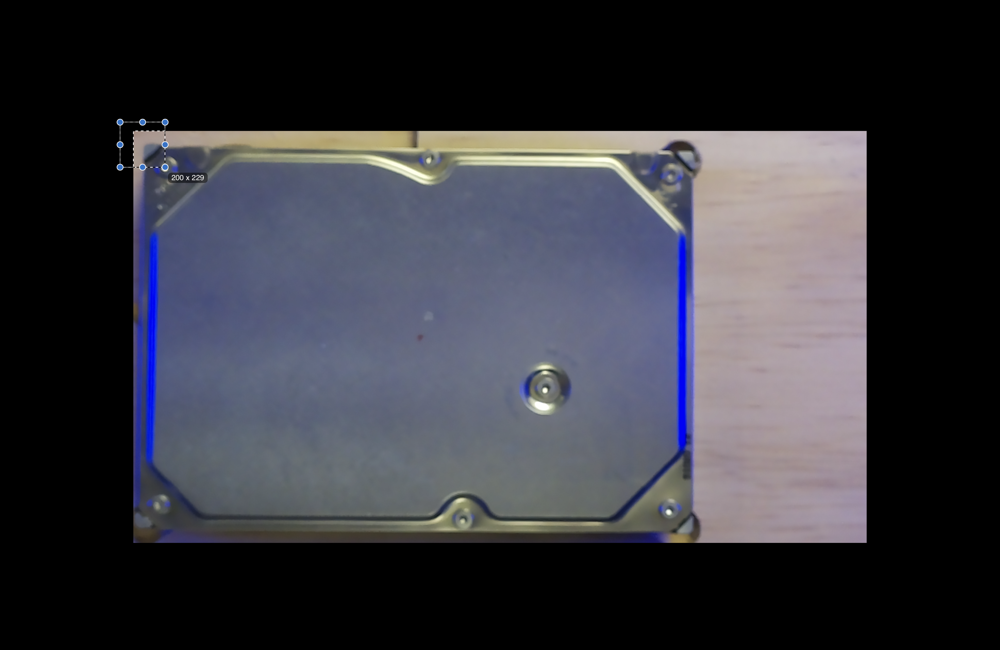
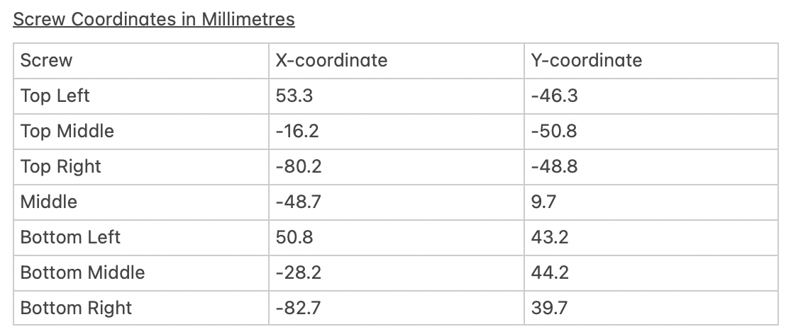
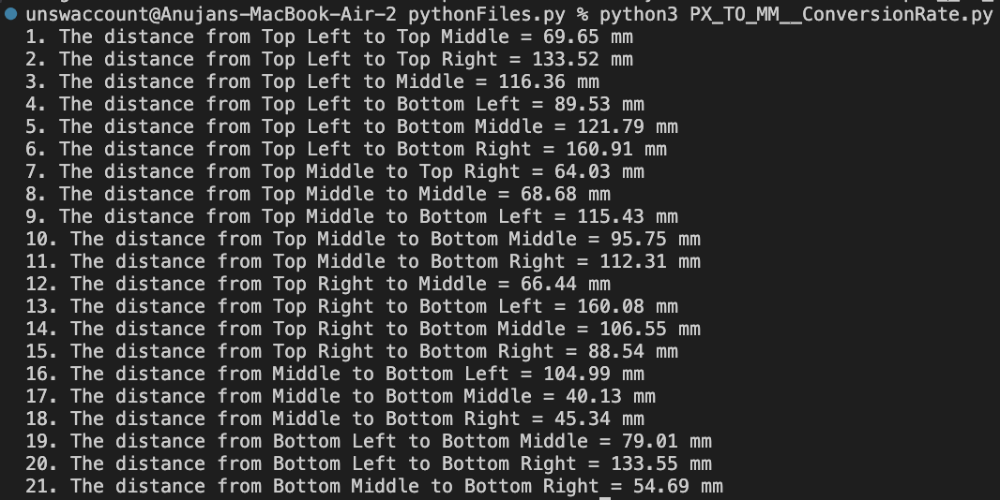
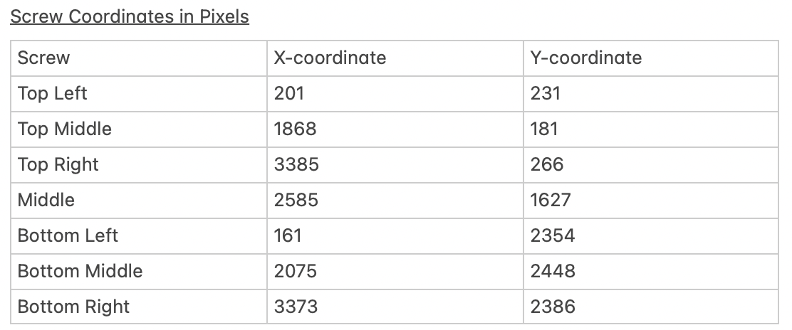
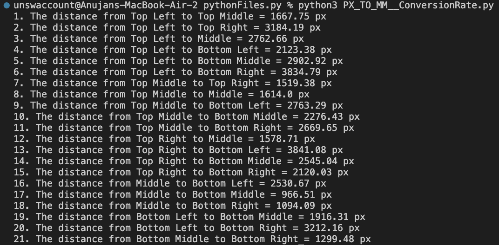
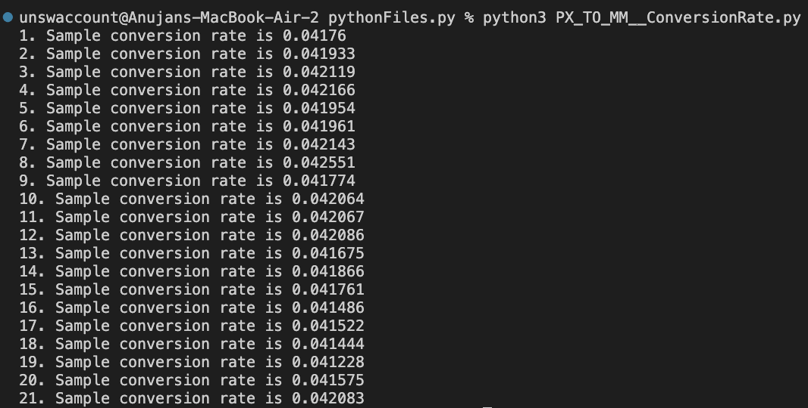

# Pixel To Millimetre Ratio

## Introduction and Motivation
Our solution for disassembling a hard drive consists of various subsystems. In this section, the relevant subsystems to consider are the **Computer Vision system** and the **Roland MDX-50 milling machine**. The primary funciton of the computer vision system at the moment is to a) take a photograph of the hard drive at a constant position and b) view this photograph and determine the position of all of the screws. The milling machine should then take these screw positions as inputs and move to each of these locations to remove the screw.

However, without further consideration, there is a problem with communicating these screw positions to the Roland. The computer vision model, upon finding the screws in an image, will provide coordinates to these screws in pixels.

**<\image/> of pixel coordinates**
**<\image/> of hard drive with annotated pixel coordinates** 

So for example, if we consider the top left screw in the above image, the reported coordinates are (199, 238). However, the units of these coordinates are in pixels. If we assume that the Roland's toolbit has the same origin as the image (the very top left corner), then what the computer vision is trying to do is get the toolbit to move 199 pixels to the right and 238 pixels down. However, if we told the Roland to move 199 to the right, it would interpret this as milimetres and instead move almost 20 cm to the right. So the need to convert **pixel distances** into **millimetre distances** arises.

## Methodology
It was hypothesised that there was a linear relationship between pixel and millimetre distances. That is, there may exist a **constant factor** which would scale a pixel distance to a millimetre distance. The overall method of determining this constant factor was as follows:
1. For the 7 screws on the top plate, find the MILLIMETRE distances between *each pair* of screws.
2. For the 7 screws on the top plate, find the PIXEL distnaces between each pair of screws.
3. For each pair of screws, take its MILLIMETRE distance and divide by its PIXEL distance
    This will give us 7C2 = 21 potential scaling factors
4. Take the average of these 21 scaling factors and note down the standard deviation

Steps 1 and 2 are explained in more detailed here:

### Step 1: Finding millimetre distances
Initially, I was planning to use a ruler to get the distance between each pair of screws. However, since the Roland can be manually moved to a position with the precision of 0.5 mm, I decided to try an alternative method. 
1. Place the hard drive as I normally would if I were about to take an image of it
2. Using the Roland's manual functionality, move the toolbit until it is right above (or gently touching) each screw
3. Record the coordinates provided by the Roland of each screw
4. Based on these coordinates, calculate the millimetre distances between each screw

NOTE that this only would have to happen once for one particular hard drive. Even if the Roland's origin point is changed (causing a change in the individual screw coordinates) the actual distances between the screws should be unchanged.

### Step 2: Finding pixel distances
Finding the pixel distances between each screw used the following method
1. Place the hard drive and camera as I normally would when taking a photograph of the hard drive (see positioningTheCamera.md)
2. Take a photograph of the hard drive
3. Use MacOS's Preview Application and its **box tool** to find the pixel coordinates of each screw

4. Based on these pixel coordinates, find the pixel distances between each screw

## Results

### Screw Coordinates in Millimetres (courtesy of the Roland)

### Distances between each pair of screws (using distance formula sqrt([x2 - x1]^2 + [y2 - y1]^2))

### Screw Coordinates in Pixels

### Distances between each pair of screws

### Getting Possible Conversion Rates (Millimetre Distance / Pixel Distance)

### Averaging All Samples to Get the final object

