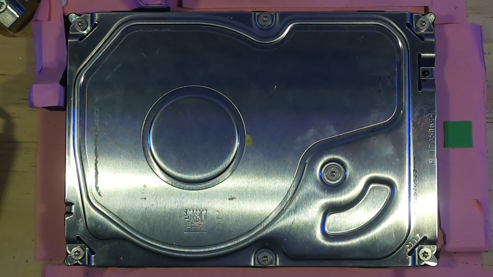
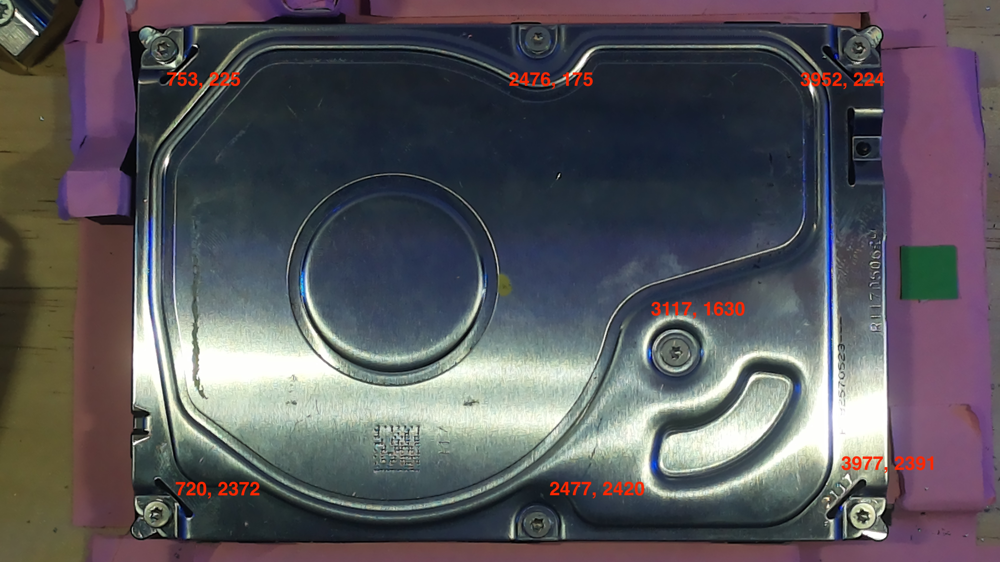

# Pixel To Millimetre Ratio

## Introduction and Motivation
Our solution for disassembling a hard drive consists of various subsystems. In this section, the relevant subsystems to consider are the **Computer Vision system** and the **Roland MDX-50 milling machine**. The primary funciton of the computer vision system at the moment is to a) take a photograph of the hard drive at a constant position and b) view this photograph and determine the position of all of the screws. The milling machine should then take these screw positions as inputs and move to each of these locations to remove the screw.

However, without further consideration, there is a problem with communicating these screw positions to the Roland. The computer vision model, upon finding the screws in an image, will provide coordinates to these screws in pixels.

So for example, if we consider the top left screw in the above image, the reported coordinates are (199, 238). However, the units of these coordinates are in pixels. If we assume that the Roland's toolbit has the same origin as the image (the very top left corner), then what the computer vision is trying to do is get the toolbit to move 199 pixels to the right and 238 pixels down. However, if we told the Roland to move 199 to the right, it would interpret this as milimetres and instead move almost 20 cm to the right. So the need to convert **pixel distances** into **real-world millimetre distances** arises.

The general idea was to find a magic constant that could be used to convert a pixel distance to a millimetre distance. It became clear that for **hard drives of different heights** this magic constant would change because the top face of the hard drive would appear closer to the camera so each pixel in the image would be "covering more ground" – that is, each pixel would represent a greater real-world distance. 

So, depending on the particular *type* of hard drive, the magic constant would change. This led to the necessity for the calculation of the magic number to be carried out as part of the automated process. Below, the methodology of the calculation is described.

## Methodology
1. Pink coloured paper is stuck to the bed of the milling machine, around where the hard drive is placed. 
2. The camera takes an image of the hard drive as expected.
3. An image post-processing sequence occurs
a. The colour of pink is filtered out of the image, leaving the hard drive behind
b. The image is turned into a binary image (black and white only)
c. Contour detection is run on the binary image
d. The largest contour is chosen – this should be the outer perimeter of the hard drive
e. The **pixel** width and height of the contour is found

To see exactly how the image post processing works, see the **edgeDetection.py** script.

6. Since the width and height of our hard drives are fixed (145 mm by 101 mm), we can divide the real millimetre width by the pixel width to find the magic number that when multiplied by the pixel width, would give the true width of the hard drive. This gives us the HORIZONTAL_RATIO. Similarly we divide the real millimetre height by the pixel height ot find the VERTICAL_RATIO. 

These numbers would then be used after finding the pixel coordinates of the screws. They would convert these coordinates into millimetre distances for the milling machine to travel to reach each screw.  

Typical values for these magic numbers range from 0.041 to 0.043.
