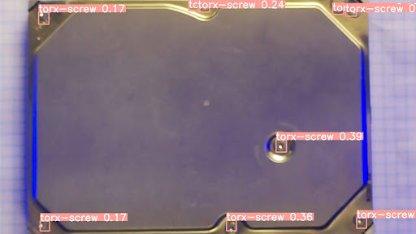

# Version 5.0 Model
Having seen the improvement from version 3.0 to 4.0 caused by combinining two separate datasets, I was motivated to try combining the v4.0's dataset to the original v1.0 dataset. Up to this point, it was clear that v1.0 could perform relatively well so long as the required zoom was provided. So v5.0 was the *retraining* of v1.0 using the dataset used to train 4.0.

## Testing and Results
v5.0 did show somewhat encouraging results when the HDD was inside the Roland, but required as much cropping as possible to be applied by the Pi camera. It is also important to note that even with this much cropping, the confidence scores for each screw were low (consistently less than 50%). This may be due to the large variation in the total dataset used to train v5.0 – all the data from 1.0 plus all the data from 4.0. Potentially this has provided version 5.0 with a much more generalised understanding of what a screw is so that an image of any particular screw will never match the model's internal representation of a screw.

It was also noted that even with all this cropping, it was often that one, maybe even two screws would either be completely missed or be misinterpreted as a hole.

Therefore, it has been decided to try again with a new model using a training dataset with less variation. The intention of this is to provide the computer vision model with a more uniform, consistent understanding of what a screw looks like. 

The complete testing set for v5.0 can be found in the subdirectory *predictionTestingSets*.
